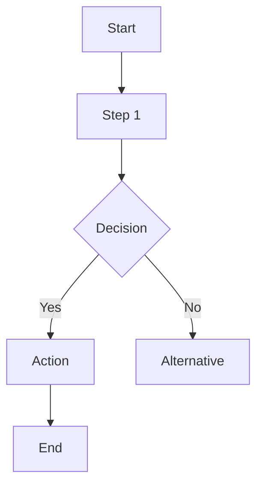
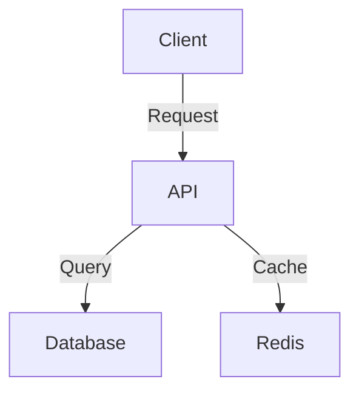
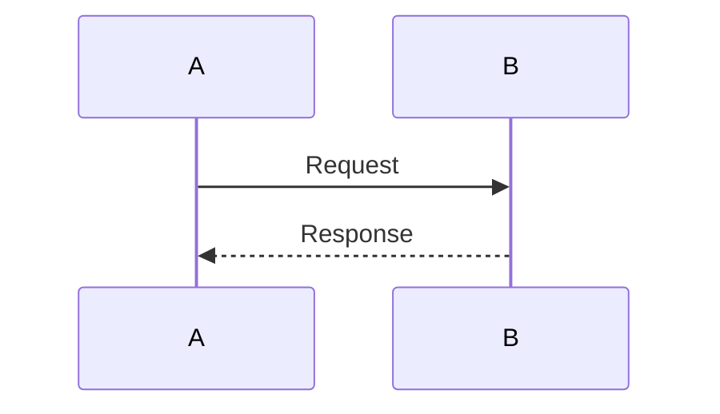

# Phase 2: Flow Diagram Generation - Implementation Guide

## Status: ✅ Backend Modules Complete

### What's Been Created

#### 1. **Detector Module** (`src/diagram/detector.ts`)
- ✅ Keyword detection system
- ✅ Diagram type classification (flowchart, architecture, sequence, class)
- ✅ Confidence scoring (0-1 scale)
- ✅ Topic extraction from user messages

**Key Function**: `detectDiagramRequest(message: string): DiagramDetectionResult`

```typescript
// Example usage
const result = detectDiagramRequest("How would you build a microservices architecture?");
// Returns:
// {
//   needsDiagram: true,
//   type: 'architecture',
//   topic: 'microservices architecture',
//   confidence: 0.85,
//   keywords: ['how would you build', 'architecture'],
//   reason: 'Diagram requested'
// }
```

#### 2. **Prompts Module** (`src/diagram/prompts.ts`)
- ✅ LLM prompts for each diagram type
- ✅ Mermaid syntax extraction
- ✅ Diagram title generation

**Key Function**: `getDiagramGenerationPrompt(context): string`

```typescript
const prompt = getDiagramGenerationPrompt({
  type: 'architecture',
  topic: 'Magento 2 Microservices',
  userMessage: 'How would you build...',
  ragContext: '...' // optional
});
```

#### 3. **Generator Module** (`src/diagram/generator.ts`)
- ✅ Mistral 7B AI integration
- ✅ Syntax extraction from LLM response
- ✅ Error handling & fallback fixes

**Key Function**: `generateDiagram(request, ai): Promise<DiagramGenerationResult>`

```typescript
const diagram = await generateDiagram({
  type: 'architecture',
  topic: 'E-commerce Platform',
  userMessage: 'How would you...',
  ragContext: '...'
}, aiBinding);
// Returns: { type, syntax, title, extractedSuccessfully }
```

#### 4. **Validator Module** (`src/diagram/validator.ts`)
- ✅ Mermaid syntax validation
- ✅ Type-specific checks (flowchart, sequence, graph, class)
- ✅ Auto-fix attempts for common errors
- ✅ Error and warning reporting

**Key Function**: `validateMermaidSyntax(syntax, type): ValidationResult`

```typescript
const validation = validateMermaidSyntax(mermaidCode, 'flowchart');
// Returns: { isValid, errors[], warnings[], corrected? }
```

#### 5. **Test Suite** (`src/diagram/test.ts`)
- ✅ 6 detector test cases
- ✅ Prompt generation tests
- ✅ Syntax extraction tests
- ✅ Validator tests (valid & invalid diagrams)

**Run tests with**:
```bash
npx ts-node src/diagram/test.ts
```

---

## Implementation Progress

### ✅ STEP 1: Backend Integration (COMPLETE)
- [x] Created database migration: `0002_create_diagrams_table.sql`
- [x] Updated `/api/chat` endpoint to:
  - [x] Import detector module
  - [x] Import generator & validator
  - [x] Integrate diagram generation into response
- [x] Test with `tsx` locally - all tests passing
- [x] Detector improvements: "design" keyword boosted for architecture context
- [x] Integration test: full flow detection → generation → validation working

**Status**: Backend fully integrated and tested. Ready for deployment.

## Next Steps: Implementation Checklist

### STEP 2: Frontend Components (Day 2)
- [ ] Create `DiagramViewer.tsx` - Mermaid rendering component
- [ ] Create `DiagramExporter.tsx` - Export functionality
- [ ] Create `MessageRenderer.tsx` - Message wrapper
- [ ] Update Message interface to include diagram field
- [ ] Add Mermaid.js to package.json

### STEP 2: Frontend Components (Day 2)
- [ ] Create `DiagramViewer.tsx` - Mermaid rendering component
- [ ] Create `DiagramExporter.tsx` - Export functionality
- [ ] Create `MessageRenderer.tsx` - Message wrapper
- [ ] Update Message interface to include diagram field
- [ ] Add Mermaid.js to package.json

### STEP 3: Frontend Integration (Day 3)
- [ ] Update `ChatWindow.tsx` to use MessageRenderer
- [ ] Add CSS styles for diagram display
- [ ] Test diagram rendering locally

### STEP 4: Testing (Days 4-5)
- [ ] Unit test each component
- [ ] Integration test full flow:
  - User asks "How would you build...?"
  - Detector triggers
  - AI generates diagram
  - Validator checks syntax
  - Frontend renders diagram + text
  - User can export
- [ ] Test with multiple diagram types
- [ ] Test error handling

### STEP 5: Deployment (Day 6)
- [ ] Deploy to staging
- [ ] Final UAT testing
- [ ] Deploy to production

---

## Diagram Types Supported

### 1. **Flowchart** (Default)
Best for: Processes, workflows, decision flows
Triggers: "flow", "process", "steps", "workflow", "how it works"



### 2. **Architecture**
Best for: System design, microservices, infrastructure
Triggers: "architecture", "how would you build", "design", "infrastructure", "components"



### 3. **Sequence**
Best for: Interactions, message flows, communication
Triggers: "sequence", "interaction", "message flow", "data flow", "communication"



### 4. **Class** (Future)
Best for: Data models, entities, relationships
Triggers: "class diagram", "entities", "database schema", "model"

---

## Detection Threshold

- **Confidence Required**: > 0.4 (40%)
- **Minimum Keywords**: 1 match
- **Minimum Message Length**: 10 characters
- **Maximum Nodes**: 50 (performance safeguard)

Examples:
- "How would you build a Magento architecture?" → **Confidence: 0.85** ✅ Generate diagram
- "What's your Magento experience?" → **Confidence: 0.15** ❌ Skip diagram
- "Flow diagram please" → **Confidence: 0.60** ✅ Generate diagram

---

## Error Handling Strategy

| Error | Response | Result |
|-------|----------|--------|
| LLM generation fails | Catch error, log, skip diagram | User gets text-only response |
| Invalid Mermaid syntax | Try auto-fix, if fails skip | User gets text response |
| Validator rejects | Log error, skip diagram | User gets text response |
| Rendering fails (frontend) | Show error message, hide diagram | Chat remains functional |

**Key Principle**: Diagrams are **enhancement, not requirement**. If diagram generation fails, chat always works.

---

## Testing Commands

### Unit Test All Modules
```bash
cd elamurugan/backend
npx ts-node src/diagram/test.ts
```

### Integration Test (once integrated with chat endpoint)
```bash
# 1. Start dev server
npm run dev

# 2. Test diagram detection
curl -X POST http://localhost:8787/api/chat \
  -H "Content-Type: application/json" \
  -d '{
    "sessionId": "test-session",
    "message": "How would you build a microservices platform?"
  }'

# 3. Verify response includes:
# - userMessage
# - assistantMessage (text)
# - diagram (with type, syntax, title)
```

---

## Frontend Integration Points

### 1. Update Message Type
```typescript
interface Message {
  id: string;
  role: 'user' | 'assistant';
  content: string;
  created_at?: string;
  isIntro?: boolean;
  diagram?: {                    // NEW
    type: DiagramType;
    syntax: string;
    title: string;
  };
}
```

### 2. Update Chat Response
```typescript
interface ChatResponse {
  success: boolean;
  assistantMessage: string;
  // ... existing fields
  diagram?: {                    // NEW
    type: DiagramType;
    syntax: string;
    title: string;
  };
}
```

### 3. Component Hierarchy
```
ChatWindow
├── MessageRenderer (new wrapper)
│   ├── Message text content (existing)
│   └── DiagramViewer (new)
│       ├── Mermaid render
│       └── DiagramExporter (copy, export SVG)
```

---

## Key Design Decisions

✅ **Text Response Always First**: Diagram is visual complement, never replacement
✅ **Graceful Degradation**: If diagram fails, user still gets text response
✅ **No Token Overhead**: Diagram generation uses separate LLM call, doesn't affect chat latency
✅ **Client-Side Rendering**: Mermaid.js renders on browser, no backend overhead
✅ **Optional Export**: Users can export diagram as SVG if needed
✅ **Separated Concern**: Diagram logic isolated in `/src/diagram/` directory

---

## Database Schema (Not Created Yet)

Will be needed for Phase 2 analytics:

```sql
CREATE TABLE diagrams_generated (
    id TEXT PRIMARY KEY,
    conversation_id TEXT NOT NULL,
    message_id TEXT NOT NULL,
    diagram_type TEXT NOT NULL,
    diagram_syntax TEXT NOT NULL,
    diagram_title TEXT,
    topic TEXT,
    created_at TEXT NOT NULL,
    viewed_count INTEGER DEFAULT 0,
    FOREIGN KEY (conversation_id) REFERENCES conversations(id) ON DELETE CASCADE,
    FOREIGN KEY (message_id) REFERENCES messages(id) ON DELETE CASCADE
);
```

---

## Performance Targets

- ⏱️ Diagram detection: < 50ms
- ⏱️ Diagram generation (LLM): < 3 seconds
- ⏱️ Syntax validation: < 100ms
- ⏱️ Mermaid rendering: < 500ms
- 📊 No impact on chat response time (separate call)

---

## Safety & Guardrails

1. **Syntax Validation**: All generated Mermaid goes through validator
2. **Confidence Threshold**: Only generate if confidence > 0.4
3. **Node Limit**: Max 50 nodes to prevent complex/unrenderable diagrams
4. **Error Logging**: All failures logged for monitoring
5. **Fallback to Text**: Diagram generation never blocks text response
6. **Frontend Error Handling**: Bad Mermaid doesn't crash chat

---

## What's Working (Phase 1 - Current Production)

✅ Chat with AI assistant
✅ Intro message on first response
✅ Proper message spacing
✅ Input clearing
✅ RAG context filtering
✅ Strict response rules (no extra info)

---

## What's Coming (Phase 2 - This Implementation)

🔄 Diagram detection
🔄 Mermaid diagram generation
🔄 Diagram rendering in chat
🔄 Diagram export (SVG)
🔄 Full testing suite

---

## Rollback Plan

If Phase 2 needs to be rolled back:

1. **Remove from backend**:
   - Comment out diagram detection in chat endpoint
   - Remove diagram field from response

2. **Remove from frontend**:
   - ChatWindow renders messages normally (no MessageRenderer)
   - Remove DiagramViewer component

3. **No database changes needed**: diagrams_generated table remains unused

**Result**: Chat works normally, just without diagrams

---

## Success Criteria

Phase 2 is complete when:

- ✅ All 4 backend modules pass tests
- ✅ Detector correctly identifies diagram needs
- ✅ Generator produces valid Mermaid syntax
- ✅ Validator catches all invalid diagrams
- ✅ Frontend renders diagrams correctly
- ✅ Diagrams don't interfere with text responses
- ✅ All 5 integration test workflows pass
- ✅ No regression in existing chat functionality

---

**Ready to proceed with Step 1: Backend Integration? 🚀**
